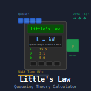

# hp-41_LittlesLaw

Calculate the variables of [Little's Law](https://corporatefinanceinstitute.com/resources/data-science/littles-law/) such as resolution time for IT Service Desk tickets.

There are two programs supplied, `LL`and `LL2`. While `LL` is specifically for calculating resolution times, `LL2` is used for calculating any of the variables `W`(Waiting time, i.e. Resolution time), `T` (Total items in the queue, i.e. number of open tickets) and `I` (Input, i.e. number of items entering the queue in the period of choice).

## LL
Use this convenient program to quickly get your average resolution times.

Upon `XEQ "LL"` you will first be prompted with `H D W M <=P?` Which means you will decide which time span (period) you are calculating the average for. Press `A` for Hours, `B` for Days, `C`for Weeks or `D` for Months. So - if you want to find out how many days it takes on average to solve a ticket in your Service Desk, then press `B`for Days. You can recalculate this to Hours, Weeks of Months later.

After pressing your desired period, you will be prompted with `QUEUE TOTAL?`. Here you will enter how big the queue currently is - e.g. how many open tickets does your Service Desk have now. Then press `R/S`.

Then you will be prompted with `QUEUE INPUT?`. Now enter the number of items (tickets) that came in during the past period. You will get a more accurate result if you take the average incoming items/tickets over the past few periods - e.g. the number of tickets received in the past week divided by 7 which is the average per day.

When this is entered and you press `R/S` you will get the calculated average resolution time (e.g. `2.14 D` if you chose Days as the Period).

Now you can recalculate this number to Hours, Days, Weeks or Months by pressing `A`, `B`, `C` or `D` respectively.

## LL2
Use this program to calculate the unknown variable in Little's Law.

Upon `XEQ LL2` you will be presented with the default Period of Days; `PERIOD = D`. You can change this at any time with the lablels `a` (Hours), `b` (Days), `c` (Weeks) or `d` (Months).

After pressing `R/S` when the Period was displayed, you will see the main menu `R T I`, representing the three variables in Little's Law (`R` is usually represented as a "W" but "R" for Resolution time is easier to remember... and "I" for Input is easier than the lambda and "T" for Total number of items in the queue is easier than "L" for Length). Each of the variables represents the program label (top row). Enter a number and press the lablel ("A" for `R`, "B" for `T` or "C" for `I`). Enter the second number and press another label to register that variable. Then simply press the last lable (without entering any number) to have the program calculate that last variable. You can then change any variable by entering a new number and press the approriate label. In short; Enter a number and press a label to register a variable. Press a label without entering a number to get that variable calculated.

If you press `R/S` when the main menu (`R T I`) is presented will show the secondary menu (shifted top row) `H D W M` indicating the periods you can choose from. Pressing `R/S` again will again remind you of the current Period.

## License
This software is released into the Public Domain.

